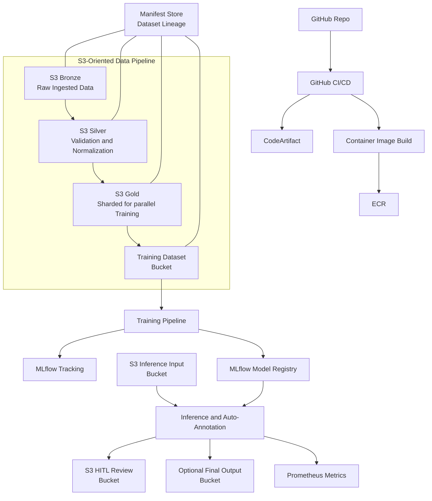

# ARCHITECTURE

This file describes the target architecture for the multi-stage ImageML pipeline.

## Key Requirements Additions
- All data and images must be staged from S3-compatible storage to local NVMe directories on the compute node before processing.
- Compute nodes running Stage 1, Stage 2, Stage 3, and Stage 4 must be provisioned with a configurable amount of NVMe.
- Annotations originate from Label Studio Pro. Annotation inputs may be:
  - Label Studio JSON export format
  - COCO JSON format
- The pipeline must use the Label Studio SDK conversion utilities to convert between Label Studio and COCO as needed.
- Stage 2 normalization must support producing multiple size variants per original image (examples: 1080p, 720p, 800x600). Size variants must be configurable.

## High-Level Architecture
- Dev commits to GitHub.
- GitHub Actions builds containers and pushes to ECR.
- Pipeline stages operate against S3-compatible boundaries and manifests.
- Each stage stages its working set to local NVMe and writes results back to S3-compatible storage.
- The manifest store provides dataset lineage and stage completion markers.
- Training logs runs and artifacts to MLflow Tracking, and registers models to MLflow Model Registry.
- Inference loads the latest approved model and produces auto-annotations plus metrics.

## Component Diagram

Notes:
- Mermaid labels are quoted to avoid Mermaid Live Editor parsing issues.
- Names like Training Pipeline represent a pluggable compute substrate.
- CodeArtifact is optional for Python, but included to match enterprise artifact patterns.

## Local NVMe Staging Model
Each stage must copy its input shard to local NVMe before processing.

Recommended local directory layout per node:
- /mnt/nvme/input
- /mnt/nvme/work
- /mnt/nvme/output
- /mnt/nvme/cache

Rules:
- Do not process directly from S3 object streams for large datasets.
- Prefer bulk transfer to NVMe, then memory-map or sequential reads from disk.
- Write outputs to NVMe first, then upload in parallel to S3-compatible storage.

Configuration:
- NVME_ROOT: root directory for staging
- NVME_MIN_GB: expected minimum size for staging capacity checks
- STAGE_INPUT_PREFIX, STAGE_OUTPUT_PREFIX: S3 prefixes mapped to local paths

## Annotations and Format Conversion
Sources:
- Label Studio Pro is the system of record for human annotation.
- Datasets may arrive as Label Studio export or as COCO.

Conversion requirement:
- Use Label Studio SDK converters to transform between formats.
- Maintain a stable mapping between:
  - image S3 URI
  - local staged file path
  - annotation record ID
  - manifest store dataset ID

Manifests should record:
- annotation_format: "label_studio" or "coco"
- converter_version: the Label Studio SDK version used
- conversion_parameters: any key parameters

## Stage 2 Multi-Variant Normalization
Stage 2 produces multiple normalized variants per original.

Example variants:
- "1080p" variant (preserve aspect ratio, cap at 1920x1080)
- "720p" variant (cap at 1280x720)
- "800x600" fixed size variant

The stage must accept a list of sizes:
- via environment variable NORMALIZE_SIZES
- or via CLI argument --sizes

Recommended encoding:
- NORMALIZE_SIZES="1080p,720p,800x600"
- A size token may be:
  - named video presets (1080p, 720p)
  - explicit WxH values

Output conventions:
- Write variants under variant-prefixed directories:
  - s3://bucket/prefix/normalized/1080p/...
  - s3://bucket/prefix/normalized/720p/...
  - s3://bucket/prefix/normalized/800x600/...

Manifest conventions:
- Each output entry includes:
  - source_uri
  - variant_name
  - output_uri
  - width
  - height
  - normalization_policy_hash

## Manifest Store Integration
The manifest store is used to:
- register datasets
- publish stage manifests
- mark objects as processed per stage
- record lineage across stages
- support idempotency in event-driven and polling modes

Expected capabilities:
- get or create dataset by name
- publish manifest with metadata and stage number
- query whether an object key has been processed for a stage
- optionally store per-stage checkpoints to support partial retries

This architecture builds on the manifest store described earlier. The implementation should use an adapter module that can be swapped for the actual manifest store service.

## Infrastructure Variants
Infrastructure must be provided as Terraform or OpenTofu, with variants for:
1. Generic AWS (EC2 and managed services)
2. EKS (Kubernetes on AWS)
3. OpenShift (AWS or on-prem, platform-specific resources where needed)
4. Local RKE2 (single node or small cluster for development)

Common requirements across variants:
- S3-compatible storage endpoints
- compute nodes with configurable NVMe
- IAM or equivalent identity for least privilege
- networking to reach MLflow and manifest store

Compute provisioning:
- Use Terraform or OpenTofu to create instances or node groups with NVMe.
- NVMe size must be configurable.
- Provide a bootstrap script or cloud-init for mounting NVMe to /mnt/nvme.

## Development and CI Environment
Provide a devcontainers environment that includes:
- RustFS as local S3-compatible storage
- PostgreSQL container for the manifest store backing store or local integration tests
- MLflow container for tracking and local model registry semantics
- Podman usage assumed, with podman-docker and podman compose compatibility

Key developer workflow:
- run local pipeline against RustFS endpoint
- validate manifests and stage outputs
- run a minimal training launch and verify MLflow artifacts

## Training Configurability
Training launcher must support:
- epochs
- images per node
- number of instances
- instance type
- training data bucket and prefix
- manifest store dataset pointer
- MLflow tracking URL
- MLflow registry URL

The training input bucket must be configurable. It must be possible to train from:
- normalized bucket variants
- a curated training bucket built from normalized outputs

